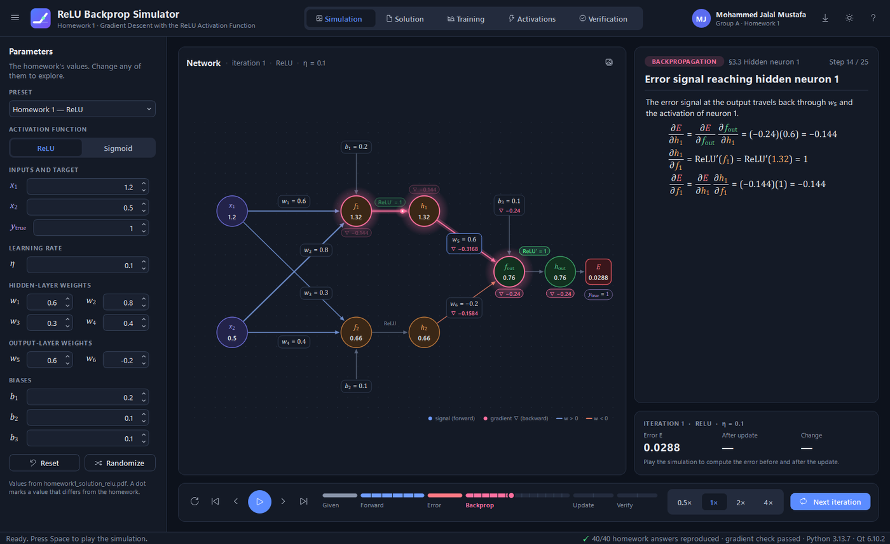
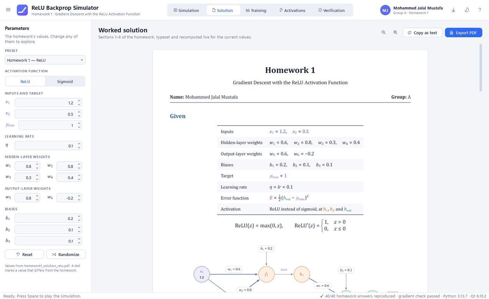
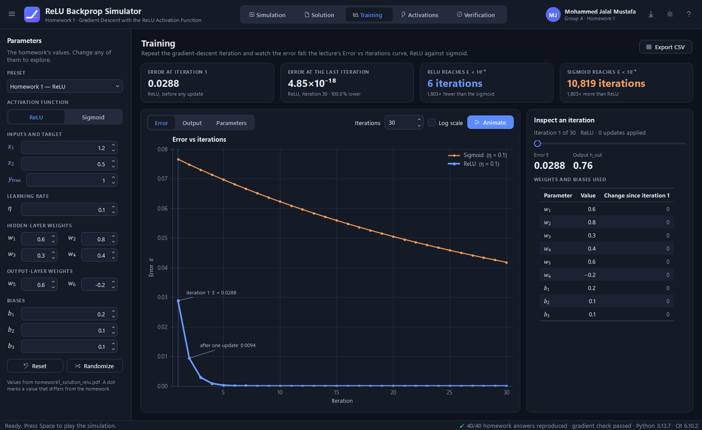
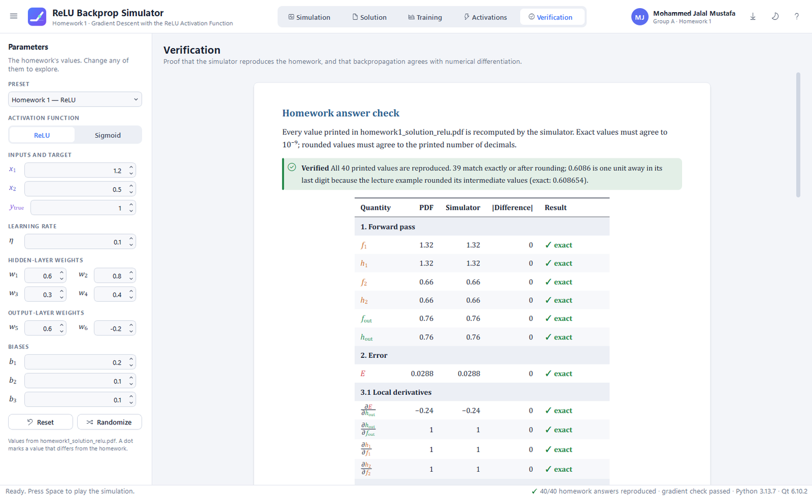

# ReLU Backprop Simulator

[](https://github.com/MohammedJMustafa/relu-backprop-simulator/actions/workflows/build.yml)
[](https://github.com/MohammedJMustafa/relu-backprop-simulator/releases/latest)
[](LICENSE)

**Homework 1: Gradient Descent with the ReLU Activation Function**
Mohammed Jalal Mustafa · Group A

An interactive desktop simulation of a 2‑2‑1 neural network that uses ReLU. It animates the forward pass,
backpropagation and the gradient‑descent update step by step. It also typesets the full worked solution,
trains the network for many iterations, compares ReLU with the sigmoid, and checks every number of the
homework solution.



---

## Download

Ready‑to‑run, self‑contained programs for every platform are attached to the
**[latest release](https://github.com/MohammedJMustafa/relu-backprop-simulator/releases/latest)**.
They need no Python and no installation.

| Platform | File | How to start |
|----------|------|--------------|
| Windows 10/11 (x64) | `ReLU-Backprop-Simulator-windows-x64.exe` | double‑click (the first start takes a few seconds) |
| macOS 13+ · Apple Silicon | `ReLU-Backprop-Simulator-macos-arm64.zip` | unzip, then right‑click the app → **Open** |
| macOS 13+ · Intel | `ReLU-Backprop-Simulator-macos-x64.zip` | unzip, then right‑click the app → **Open** |
| Linux x64 (glibc 2.35+) | `ReLU-Backprop-Simulator-linux-x64` | `chmod +x ReLU-Backprop-Simulator-linux-x64 && ./ReLU-Backprop-Simulator-linux-x64` |
| Linux arm64 (glibc 2.39+) | `ReLU-Backprop-Simulator-linux-arm64` | `chmod +x …` then run it |

The programs are built by [GitHub Actions](.github/workflows/build.yml) on each platform. Each build is
checked there with `--self-test --gui` before it is published.

*Notes:*
- The macOS app is not notarized by Apple, which is why the first start needs right‑click → Open.
- On some Linux systems Qt needs the package `libxcb-cursor0` (`sudo apt install libxcb-cursor0`).

---

## Run from source

**Windows:** double‑click **`run_simulation.bat`**.
- The launcher uses an installed Python 3 that already has PySide6, matplotlib and numpy.
- If there is none, it creates a private environment once, in `%LOCALAPPDATA%\ReLUBackpropSim\venv`, and installs them there.
- `run_simulation.bat debug` shows a console with error messages.
- `run_simulation.bat selftest` checks the homework answers.

**macOS / Linux** (Python 3.9+):

```bash
python3 -m venv .venv && source .venv/bin/activate
pip install -r requirements.txt
python main.py                      # open the simulator
python main.py --self-test          # check all 40 homework answers (no window)
python main.py --self-test --gui    # ... and exercise the whole interface off-screen
```

**Build your own executable:**
- On Windows, `build_exe.bat` creates `dist\ReLU Backprop Simulator.exe` (one file, about 75 MB).
- On other systems, see the PyInstaller commands in the workflow.

---

## What the simulator shows

| Page | Contents |
|------|----------|
| **Simulation** | The network of Figure 1, animated through **25 steps**. In the forward pass, signal pulses travel along the edges and values fill the neurons. In backpropagation, gradient pulses travel backwards and each weight shows its gradient ∇. ReLU gates show ReLU′, and a dead gate (ReLU′ = 0) visibly blocks the gradient. During the update, weights morph from old to new. Verification then re‑runs the forward pass. A synced card shows the exact equation of each step with real fractions, as in the PDF. Controls: play/pause, step, phase jumps, a clickable timeline, speed, and **Next iteration**, which keeps training. |
| **Solution** | Sections 1–6 of the homework, typeset like the original (Figure 1, Table 1, boxed answers). It is recomputed live for any values and exported as an A4 **PDF** with the student's name. |
| **Training** | The *Error vs Iterations* curve, ReLU against sigmoid (linear or log scale), plus *Output* and *Parameters* views. An inspector shows the weights used at any iteration, and tiles show "E < 10⁻⁴ after **6** iterations (ReLU) vs **10,819** (sigmoid)". Exports to CSV. |
| **Activations** | g(z) and g′(z) with the neurons' inputs marked, the σ′ ≤ 0.25 bound, the gradient size of every parameter (ReLU ≈ 15× larger for w₁), and the comparison of section 6. |
| **Verification** | All **40** values printed in the homework solution compared with the simulator, plus a numerical gradient check of the backpropagation. |

The **parameter sidebar** edits every value: inputs, target, learning rate, weights and biases. It also
switches between ReLU and sigmoid and offers four presets:
- Homework (default)
- Lecture sigmoid
- Dead hidden neuron
- Dead output neuron

Everything updates instantly. Light and dark themes are available; the app follows the system by default.

| | |
|---|---|
|  |  |

**Keyboard:**
- `Space` play/pause · `←`/`→` previous/next step · `Page Up`/`Page Down` previous/next phase
- `Home`/`End` first/last step · `Ctrl+N` next iteration · `Ctrl+1…5` pages
- `Ctrl+R` reset · `Ctrl+B` show/hide parameters · `Ctrl+T` theme
- `Ctrl+E` export PDF · `Ctrl+Shift+S` save PNG · `F1` help

---

## The homework's numbers

The simulator reproduces all of the homework's values:
- the forward pass, and the error E = 0.0288;
- the nine gradients and the nine updated parameters;
- the error after one update, E ≈ 0.0094;
- the sigmoid comparison.

The Verification page and `--self-test` print the full comparison.



> **A remark on the printed solution:** in the comparison table (section 6) the sigmoid output is printed as
> **0.6086**. The exact value is **0.608654**, which rounds to **0.6087**. The lecture example rounded its
> intermediate values. The other sigmoid numbers (0.0766, −0.0112, 0.0748) are correct.

---

## Project structure

```
main.py                    entry point (also --self-test [--gui])
run_simulation.bat         Windows launcher (finds or installs the Python packages)
build_exe.bat              Windows: build a one-file executable with PyInstaller
requirements.txt           PySide6-Essentials, matplotlib, numpy
.github/workflows/         builds and releases the executables for every platform
relu_sim/
  homework.py              the given values, the student, the printed answers, presets
  selftest.py              the command-line and CI self-test
  core/                    the maths - pure Python, no GUI
    activations.py         ReLU (ReLU'(0) = 0, as in the homework) and a numerically stable sigmoid
    network.py             forward pass, backpropagation, gradient-descent update
    training.py            many iterations; iterations until E < threshold
    gradcheck.py           numerical gradient check
    verification.py        compares the simulator with every printed answer
  content/                 the explanations as plain data - no GUI
    mathexpr.py            a small math-expression tree (fractions, scripts, vectors, ...)
    solution.py            the worked solution, sections 1-6, for any values
    timeline.py            the 25 simulation steps (text, equations, what the diagram shows)
    report.py              the Verification and Activations documents
  ui/                      the PySide6 application
    math_painter.py        typesets the math trees (TeX-like layout) with QPainter
    document_painter.py    lays out documents for the screen and for the PDF export
    network_painter.py     the animated network diagram
    pages/  widgets/       the five pages and their building blocks
  assets/                  the app icon
```

The layers depend only downwards: `core` → `content` → `ui`. The maths and all the explanations are
plain Python, and one renderer draws the screen, the PNG and the PDF.

## Troubleshooting

* **The window does not open (Windows, from source):** run `run_simulation.bat debug` to see the error.
  The app also writes a log to `%LOCALAPPDATA%\ReLUBackpropSim\logs\app.log`.
* **"Python 3 was not found":** install Python from <https://www.python.org/downloads/>, tick
  *Add python.exe to PATH*, then run `run_simulation.bat` again.

## License

[MIT](LICENSE) © 2026 Mohammed Jalal Mustafa
